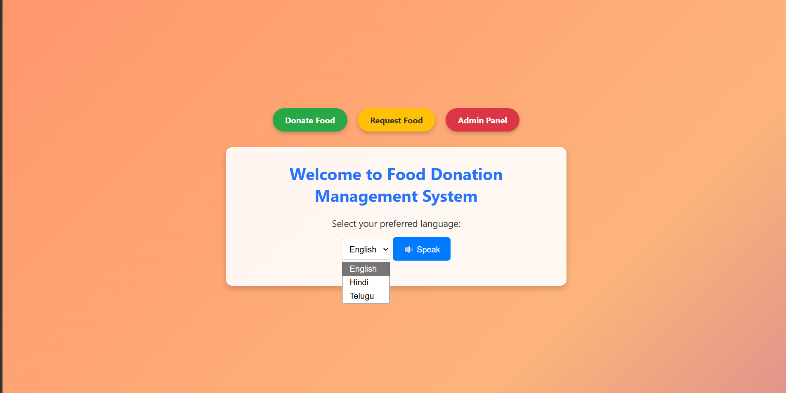
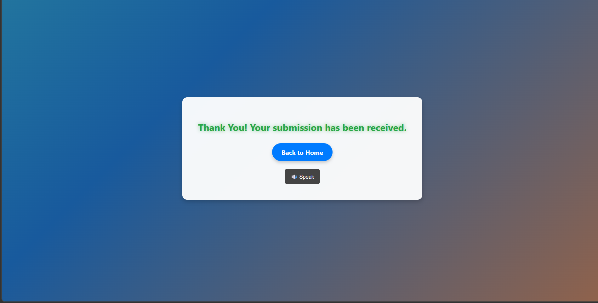
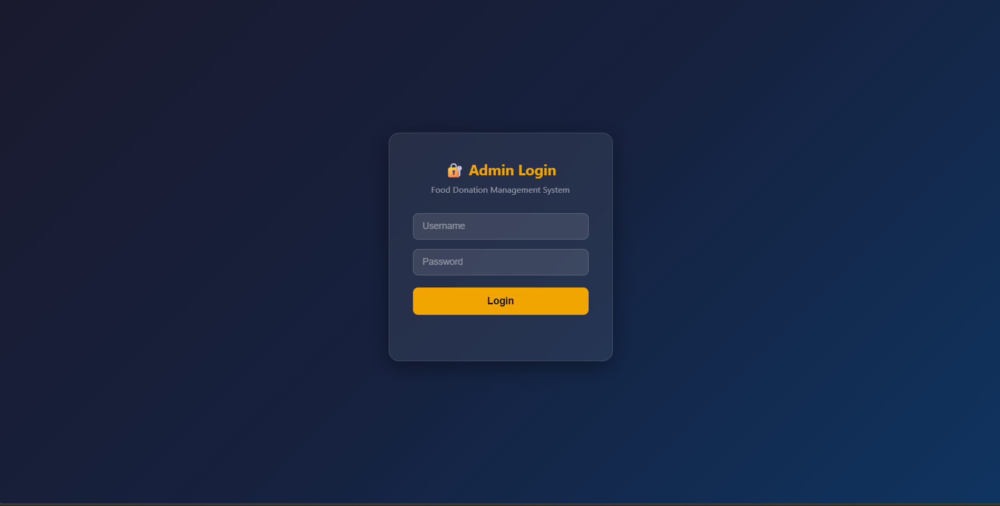
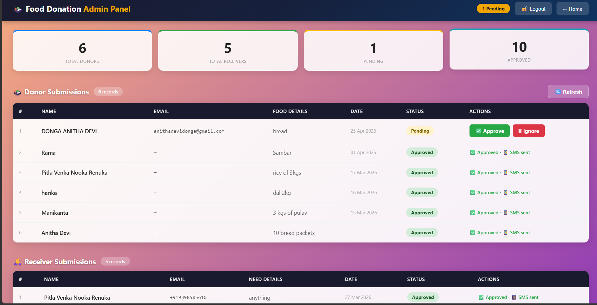

<h1 align="center">🍱 Food Donation Management System</h1>

A platform that connects food donors with NGOs to reduce food waste and help people in need.

## 🚀 Overview
The Food Donation Management System is a mission-driven backend platform designed to bridge the gap between food donors (restaurants, hotels, individuals) and recipients (NGOs, shelters, food banks).

By automating food recovery logistics, the system helps reduce food waste and combat hunger in real-time.

Built with a modern Node.js stack, the platform tracks surplus food and enables fast claiming through automated communication channels.

---

## ✨ Features
- Donor portal for submitting surplus food
- Receiver portal for NGOs and shelters
- Admin dashboard to monitor donations
- Real-time SMS notifications using Twilio
- Secure authentication using JSON Web Tokens (JWT)
- MongoDB database with schema validation using Mongoose

---

## 🛠 Tech Stack

### Backend
- Node.js (v20+)
- Express.js

### Database
- MongoDB
- Mongoose (Schema validation)

### APIs & Utilities
- Twilio – SMS notifications
- Axios – External API requests
- Day.js – Time and expiration handling

### Security
- JSON Web Tokens (JWT) – Authentication
- SCMP – Secure comparison
- Lodash – Data validation

---

## 🏗 System Architecture
The system works as a centralized hub connecting donors and recipients.

1. Donation Portal  
   Donors submit surplus food details including quantity and expiration time.

2. Validation Layer  
   Mongoose schemas verify food data integrity before storing it in MongoDB.

3. Notification Engine  
   Twilio sends SMS alerts to nearby NGOs when a new donation is available.

4. Claim System  
   NGOs or shelters claim donations and the system updates the status.

---

## 📁 Project Structure
Food-Donation-Management-System  
│  
├── models/  
├── node_modules/  
├── admin.html  
├── donor.html  
├── receiver.html  
├── index.html  
├── thankyou.html  
├── style.css  
├── script.js  
├── notification.js  
├── server.js  
├── package.json  
├── package-lock.json  
└── .gitignore  

---

## 🚦 Getting Started

### Prerequisites
- Node.js (v20+)
- MongoDB Atlas or Local MongoDB
- Twilio account for SMS notifications

### Installation

Clone the repository
git clone https://github.com/YOUR-USERNAME/Food-Donation-Management-System.git

Navigate to the project folder
cd Food-Donation-Management-System

Install dependencies
npm install

---

### Environment Setup
Create a `.env` file in the root directory and add the following:

PORT=3000  
MONGODB_URI=your_mongodb_connection_string  
TWILIO_ACCOUNT_SID=your_sid  
TWILIO_AUTH_TOKEN=your_token  
JWT_SECRET=your_secret_key  

---

### Run the Application
Start the server

npm start

The application will run on:

http://localhost:3000

---

## 🎯 Future Improvements
- Location-based food distribution
- Real-time donation tracking
- Mobile application support
- Automated logistics coordination

---

## 📜 License
This project is licensed under the MIT License.

---

## 👨‍💻 Author
B.Tech Data Science Student  
Passionate about building technology solutions to solve real-world problems.

## 📸 Project Preview

### 🏠 Home Page

### 🍱 Donate Page

### 📥 Receiver Page

### 🎉 Thank You Card

### 🔐 Admin Login

### ⚙️ Admin Dashboard

